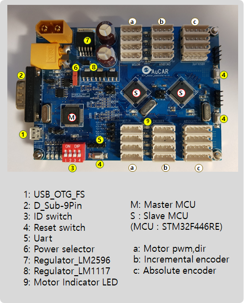

# AuCAR
#### controller "AuCAR" for swerve driving.
###### operate with ros
###### toolchain : STM32CUBEIDE 1.0.1
###### firmware ver : F4 1.24.1

## Operating Demo

## I/O descriptions

## images

